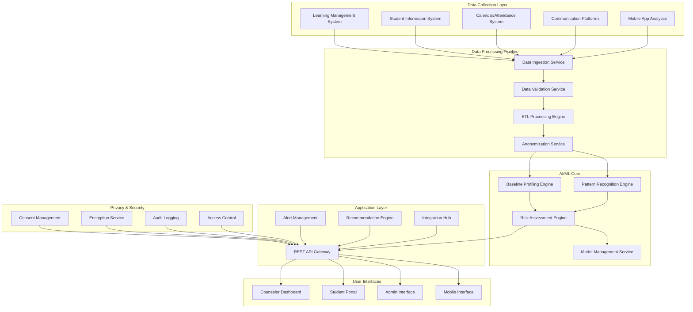

# Design Document: AI-Powered Early Burnout Detection System

## Overview

The AI-Powered Early Burnout Detection System is a comprehensive platform that leverages machine learning to identify early warning signs of student burnout through multi-dimensional behavioral analysis. The system addresses the critical gap in traditional reactive approaches by providing proactive, personalized burnout risk assessment and intervention recommendations.

The system operates on the principle that burnout manifests through subtle, personalized patterns in student behavior that evolve over time. By establishing individual baselines and continuously monitoring deviations across multiple behavioral dimensions, the AI can detect early warning signs weeks or months before traditional methods would identify problems.

Key design principles include privacy-by-design, ethical AI practices, seamless integration with existing educational infrastructure, and human-in-the-loop decision making to ensure appropriate interventions.

## Architecture

The system follows a microservices architecture with clear separation of concerns, enabling scalability, maintainability, and compliance with educational data privacy regulations.



## Components and Interfaces

### Data Collection Layer

**Learning Management System Connector**
- Interfaces: REST APIs, LTI 1.3 compliance
- Data collected: Login patterns, course engagement, assignment submissions, quiz performance, discussion participation
- Update frequency: Real-time for critical events, hourly batch for analytics

**Student Information System Connector**
- Interfaces: SOAP/REST APIs, SIF compliance
- Data collected: Academic records, enrollment status, demographic information, course schedules
- Update frequency: Daily synchronization

**Communication Analytics Module**
- Interfaces: Email APIs, messaging platform webhooks
- Data collected: Communication frequency, response times, tone analysis (anonymized)
- Privacy controls: Opt-in only, content anonymization, sentiment analysis without content storage

### AI/ML Core Components

**Baseline Profiling Engine**
- Purpose: Establishes individual student behavioral baselines using historical data
- Algorithm: Ensemble of time-series analysis, clustering, and statistical modeling
- Input: Minimum 4 weeks of historical behavioral data
- Output: Individual baseline profiles with confidence intervals

**Pattern Recognition Engine**
- Purpose: Identifies deviations from established baselines and complex interaction patterns
- Algorithm: Deep learning models (LSTM networks for temporal patterns, transformer models for multi-dimensional analysis)
- Features: Attention mechanisms for interpretability, anomaly detection for outlier identification
- Update cycle: Continuous learning with weekly model updates

**Risk Assessment Engine**
- Purpose: Calculates burnout risk scores and generates predictions
- Algorithm: Gradient boosting models with explainable AI components
- Output: Risk scores (0-100), confidence levels, contributing factor analysis
- Calibration: Regular validation against counselor assessments and student outcomes

### Privacy and Security Framework

**Consent Management System**
- Granular consent controls for different data types and processing purposes
- Dynamic consent withdrawal with immediate data processing cessation
- Audit trails for all consent changes and data access events
- FERPA and GDPR compliance validation

**Data Anonymization Pipeline**
- Differential privacy techniques for statistical analysis
- K-anonymity for demographic data protection
- Pseudonymization for longitudinal analysis while preserving privacy
- Secure multi-party computation for cross-institutional analysis

## Data Models

### Student Behavioral Profile

```
StudentProfile {
  student_id: UUID (pseudonymized)
  baseline_metrics: {
    study_patterns: {
      avg_session_duration: Duration
      preferred_study_times: TimeRange[]
      weekly_study_hours: Float
      consistency_score: Float (0-1)
    }
    engagement_patterns: {
      forum_participation_rate: Float
      assignment_submission_timing: Distribution
      quiz_attempt_patterns: Pattern
      help_seeking_frequency: Float
    }
    communication_patterns: {
      response_time_distribution: Distribution
      communication_frequency: Float
      tone_baseline: SentimentProfile
    }
  }
  risk_factors: {
    historical_stress_periods: Period[]
    known_vulnerabilities: Factor[]
    protective_factors: Factor[]
  }
  privacy_settings: ConsentProfile
  last_updated: Timestamp
}
```

### Risk Assessment Model

```
RiskAssessment {
  assessment_id: UUID
  student_id: UUID (pseudonymized)
  timestamp: Timestamp
  risk_score: Float (0-100)
  confidence_level: Float (0-1)
  contributing_factors: {
    factor_name: String
    impact_weight: Float
    trend_direction: Enum[increasing, decreasing, stable]
    evidence_strength: Float (0-1)
  }[]
  recommendations: InterventionRecommendation[]
  alert_level: Enum[low, medium, high, critical]
  model_version: String
  explainability_data: ExplanationMetadata
}
```

### Intervention Recommendation

```
InterventionRecommendation {
  recommendation_id: UUID
  type: Enum[academic_support, counseling, peer_support, workload_adjustment]
  priority: Enum[low, medium, high, urgent]
  description: String
  estimated_effectiveness: Float (0-1)
  resource_requirements: ResourceRequirement[]
  timeline: Duration
  success_metrics: Metric[]
  personalization_factors: Factor[]
}
```

## Correctness Properties

*A property is a characteristic or behavior that should hold true across all valid executions of a system—essentially, a formal statement about what the system should do. Properties serve as the bridge between human-readable specifications and machine-verifiable correctness guarantees.*

Before defining the correctness properties, I need to analyze the acceptance criteria from the requirements to determine which ones are testable as properties.

### Property 1: Comprehensive Data Collection
*For any* student interaction with educational systems, the system should capture all relevant behavioral signals (study patterns, attendance, assignments, communications) and integrate them into a unified behavioral profile while preserving privacy constraints.
**Validates: Requirements 1.1, 1.2, 1.3, 1.4, 1.5**

### Property 2: Baseline Profile Establishment
*For any* student with sufficient historical data, the system should establish individual baseline profiles that accurately represent their normal behavioral patterns.
**Validates: Requirements 2.1**

### Property 3: Pattern Deviation Detection and Risk Assessment
*For any* new behavioral data that deviates from established baselines, the system should calculate appropriate burnout risk scores using machine learning models and identify complex interaction patterns.
**Validates: Requirements 2.2, 2.3, 2.4**

### Property 4: Uncertainty Handling
*For any* prediction with low model confidence, the system should flag the prediction for human review rather than acting on uncertain information.
**Validates: Requirements 2.5**

### Property 5: Alert Generation and Content
*For any* burnout risk score that exceeds defined thresholds, the system should generate early warning alerts that include risk level, contributing factors, and confidence scores.
**Validates: Requirements 3.1, 3.2**

### Property 6: Systemic Pattern Recognition
*For any* group of students showing similar risk patterns, the system should identify potential systemic issues that may require institutional-level intervention.
**Validates: Requirements 3.3**

### Property 7: Adaptive Alert Management
*For any* situation where alert frequency becomes excessive, the system should automatically adjust sensitivity to prevent alert fatigue while maintaining detection effectiveness.
**Validates: Requirements 3.4**

### Property 8: Feedback Learning
*For any* alert that is dismissed or acted upon, the system should incorporate the feedback to improve future prediction accuracy.
**Validates: Requirements 3.5**

### Property 9: Privacy Consent Management
*For any* student first using the system, explicit informed consent must be obtained before any data collection or analysis begins.
**Validates: Requirements 4.1**

### Property 10: Data Protection Round Trip
*For any* personal data processed by the system, appropriate anonymization and encryption should be applied, and the data should remain protected throughout all processing stages.
**Validates: Requirements 4.2**

### Property 11: Data Access Transparency
*For any* student request for data access, the system should provide complete records of all collected data and analysis results.
**Validates: Requirements 4.3**

### Property 12: Consent Withdrawal Processing
*For any* student who withdraws consent, the system should immediately cease data collection and securely delete all existing data.
**Validates: Requirements 4.4**

### Property 13: Conditional Data Sharing
*For any* situation where data sharing with counselors is required, separate consent must be obtained and access limited to only necessary information.
**Validates: Requirements 4.5**

### Property 14: Personalized Intervention Recommendations
*For any* early warning alert generated, the system should provide personalized intervention recommendations that consider student preferences, available resources, and historical effectiveness.
**Validates: Requirements 5.1, 5.2**

### Property 15: Intervention Outcome Tracking
*For any* intervention that is implemented, the system should track outcomes and adjust future recommendations based on effectiveness.
**Validates: Requirements 5.3**

### Property 16: Maintenance Strategy Recommendations
*For any* student showing improvement, the system should recommend appropriate maintenance strategies to prevent relapse.
**Validates: Requirements 5.4**

### Property 17: Escalation for Low Effectiveness
*For any* intervention with low effectiveness, the system should escalate to human counselors for direct assessment.
**Validates: Requirements 5.5**

### Property 18: Data Processing Timeliness
*For any* new data collected, the system should process it within 24 hours to ensure timely risk assessment.
**Validates: Requirements 6.1**

### Property 19: Prediction Accuracy Maintenance
*For any* risk assessment generated, the system should maintain prediction accuracy above 85% based on validation datasets.
**Validates: Requirements 6.2**

### Property 20: Automatic Scaling
*For any* increase in system load, the system should scale automatically to maintain performance standards.
**Validates: Requirements 6.3**

### Property 21: Failure Recovery and Data Preservation
*For any* system failure, the system should recover within 4 hours while preserving all student data integrity.
**Validates: Requirements 6.4**

### Property 22: Training Data Diversity
*For any* AI model training process, the system should use diverse datasets that are representative of the student population.
**Validates: Requirements 7.1**

### Property 23: Bias Detection and Auditing
*For any* prediction made by the system, regular auditing for demographic bias and discrimination should occur.
**Validates: Requirements 7.2**

### Property 24: Automatic Bias Mitigation
*For any* detected bias in the system, automatic model retraining with bias mitigation techniques should be triggered.
**Validates: Requirements 7.3**

### Property 25: Equitable Support Quality
*For any* recommendation provided, the system should ensure equal quality of support across all student demographic groups.
**Validates: Requirements 7.4**

### Property 26: AI Decision Transparency
*For any* AI decision made by the system, transparent logs should be maintained for accountability and auditability.
**Validates: Requirements 7.5**

### Property 27: Standard Integration Protocols
*For any* connection to external educational systems, the system should use standard APIs and authentication protocols.
**Validates: Requirements 8.1**

### Property 28: Data Consistency Maintenance
*For any* integration with student information systems, the system should maintain data consistency and synchronization.
**Validates: Requirements 8.2**

### Property 29: Secure Data Exchange
*For any* interface with counseling systems, the system should provide secure data exchange capabilities.
**Validates: Requirements 8.3**

### Property 30: Rolling Update Support
*For any* system update required, the system should support rolling updates without service interruption.
**Validates: Requirements 8.4**

### Property 31: Legacy System Compatibility
*For any* legacy system that exists, the system should provide backward compatibility and migration support.
**Validates: Requirements 8.5**

## Error Handling

The system implements comprehensive error handling across all components to ensure reliability and data integrity:

### Data Collection Errors
- **Missing Data Sources**: Graceful degradation when data sources are unavailable, with confidence score adjustments
- **Data Quality Issues**: Automatic data validation with flagging of suspicious or inconsistent data points
- **API Failures**: Retry mechanisms with exponential backoff and circuit breaker patterns
- **Rate Limiting**: Intelligent throttling to respect external system limits while maintaining data freshness

### AI/ML Processing Errors
- **Model Failures**: Fallback to simpler models or human review when primary models fail
- **Insufficient Data**: Clear indicators when baseline establishment requires more data
- **Prediction Uncertainty**: Explicit confidence intervals and uncertainty quantification
- **Bias Detection**: Automatic alerts when bias metrics exceed acceptable thresholds

### Privacy and Security Errors
- **Consent Violations**: Immediate data processing halt when consent issues are detected
- **Encryption Failures**: Secure failure modes that prevent data exposure
- **Access Control Breaches**: Comprehensive audit logging and automatic access revocation
- **Data Retention Violations**: Automated data lifecycle management with compliance monitoring

### System Integration Errors
- **External System Failures**: Cached data usage with staleness indicators
- **Authentication Failures**: Secure re-authentication flows without service disruption
- **Data Synchronization Issues**: Conflict resolution algorithms with human oversight options
- **Performance Degradation**: Automatic load balancing and resource scaling

## Testing Strategy

The testing strategy employs a dual approach combining unit testing for specific scenarios with property-based testing for comprehensive validation of system behaviors.

### Property-Based Testing Framework

The system will use **Hypothesis** (Python) for property-based testing, configured to run a minimum of 100 iterations per property test to ensure comprehensive input coverage. Each property test will be tagged with comments referencing the corresponding design document property.

**Property Test Configuration:**
- **Minimum iterations**: 100 per test
- **Timeout**: 30 seconds per property
- **Shrinking**: Enabled for minimal failing examples
- **Seed management**: Reproducible test runs with saved seeds
- **Coverage tracking**: Integration with coverage tools to ensure comprehensive testing

**Tag Format**: Each property test will include a comment:
```python
# Feature: ai-burnout-detection, Property 1: Comprehensive Data Collection
```

### Unit Testing Strategy

Unit tests complement property tests by focusing on:

**Specific Examples and Edge Cases:**
- Boundary conditions for risk score calculations
- Specific privacy scenarios (consent withdrawal, data access requests)
- Integration points between system components
- Error conditions and recovery scenarios

**Mock and Stub Strategy:**
- External system dependencies (LMS, SIS) will be mocked for isolated testing
- AI/ML models will use deterministic test doubles for predictable behavior
- Database interactions will use in-memory test databases
- Time-dependent operations will use controllable time mocking

**Test Data Management:**
- Synthetic student data generation for privacy-compliant testing
- Anonymized historical data for baseline testing (where permitted)
- Diverse demographic data to test bias prevention
- Edge case data sets for robustness testing

### Integration Testing

**End-to-End Scenarios:**
- Complete student lifecycle from enrollment to graduation
- Multi-system data flow validation
- Privacy compliance across system boundaries
- Performance testing under realistic load conditions

**Security Testing:**
- Penetration testing for data protection
- Privacy compliance validation
- Access control verification
- Encryption and anonymization effectiveness

### Continuous Testing Pipeline

**Automated Testing:**
- Property tests run on every code change
- Unit tests integrated into CI/CD pipeline
- Performance regression testing
- Security scanning and compliance checking

**Manual Testing:**
- User acceptance testing with counselors and administrators
- Accessibility testing for all user interfaces
- Usability testing for alert and recommendation systems
- Ethical review of AI decision-making processes

The comprehensive testing strategy ensures that the AI-Powered Early Burnout Detection System meets all functional requirements while maintaining the highest standards of privacy, security, and ethical AI practices.